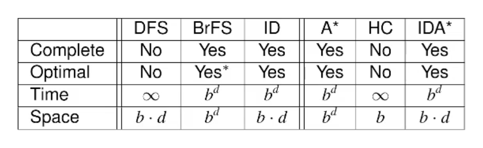

<!-- START doctoc generated TOC please keep comment here to allow auto update -->
<!-- DON'T EDIT THIS SECTION, INSTEAD RE-RUN doctoc TO UPDATE -->
**Table of Contents**  *generated with [DocToc](https://github.com/thlorenz/doctoc)*

- [1. Search Space](#1-search-space)
        - [Example](#example)
- [2. Search Methods](#2-search-methods)
  - [Blind Search vs. Informed Search](#blind-search-vs-informed-search)
  - [Blind Systematic Search](#blind-systematic-search)
  - [Heuristic Functions](#heuristic-functions)
        - [Properties of h(n)](#properties-of-hn)
        - [Relationships (Only these two)](#relationships-only-these-two)
  - [Informed Systematic Search Algorithms](#informed-systematic-search-algorithms)
      - [Greedy Best-First Search (with duplicate detection)](#greedy-best-first-search-with-duplicate-detection)
      - [A* (with duplicate detection and re-opening)](#a-with-duplicate-detection-and-re-opening)
      - [Weighted A*](#weighted-a)
    - [Local Search](#local-search)
      - [Hill-Climbing](#hill-climbing)
      - [Enforced Hill-Climbing](#enforced-hill-climbing)
      - [Iterative Deepening A*](#iterative-deepening-a)
- [3. Search Methods Evaluations](#3-search-methods-evaluations)
  - [Summary](#summary)

<!-- END doctoc generated TOC please keep comment here to allow auto update -->

## 1. Search Space
A classical search space:
- $\mathrm{start}(\cdot)$
- $\mathrm{is}\_\mathrm{target}(s)$ $s$ = search states
- $\mathrm{succ}(s)$ find the successors/next states of $s$

- **Progression**: search states = world states
- **Regression**: search states = sets of world states (conjunctive sub-goals)

- Search states: states(verities) of the search space
- Search nodes: 
	- $\mathrm{state}(\sigma)$
	- $\mathrm{parent}(\sigma)$ where $\sigma$ was reached
	- $\mathrm{action}(\sigma)$ leads from $\mathrm{state}(\mathrm{parent}(\sigma))$ to $\mathrm{state}(\sigma)$
	- $g(\sigma)$ denotes cost of path from the **root** to $\sigma$
	- The **root**’s $\mathrm{parent}(\cdot)$ and $\mathrm{action}(\cdot)$ are undefined

###### Example
In a robot delivery scene:
```
world_state_of_the_robot = {
    "position": (3, 5),
    "direction": "North",
    "battery": 80,
    "carrying_package": True
}
```
Progression: 搜索树上的每个节点就是机器人在某个位置、朝向、能量、负载的组合状态。
Regression:  搜索树上的每个节点共同组成“我们想要所有满足一个条件的世界状态集合”。
```
subgoals = {"position": (5, 8), "carrying_package": True}
```
## 2. Search Methods
### Blind Search vs. Informed Search
- Blind search not require any input beyond the problem
- No additional work but rarely effective
- Informed search requires function $h(x)$ mapping states to estimates their goal distance
- Effective but lots of work to construct $h(x)$

### Blind Systematic Search
- **BFS**
- **DFS**
- **Iterative Deepening Search**
	Do DLS(DFS with depth limited) with continuously increasing depth limited

BSS - *Completeness* 100%, but *less efficient* when doing hard work

### Heuristic Functions
- **Heuristic Function** $h(n)$ 
	- Estimated remaining cost (heuristic value) from current state to goal state
	- **h*(n)** real remaining cost
- **proficiency of $h(n)$ **
	- $h = h^*$ perfectly informed, $h(n) = h^*(n) - \textbf{optimal } A^*$
	- $h = 0$ no information at all - uniform cost search
###### Properties of h(n)
- **Safe** $h(n) = \infty$ only if $h^*(n) = \infty$
- **Goal-aware** $h(\text{goal}) = 0$
- **Admissible** $h(n) \le h^*(n)$
- **Consistent** $h(n) \le c(n,n’) + h(n’)$ for all possible $c(n, n’)$
###### Relationships (Only these two)
- Consistent and Goal-aware → Admissible
- Admissible → Safe and Goal-aware

### Informed Systematic Search Algorithms
##### Greedy Best-First Search (with duplicate detection)
- Use priority queue to sort $h(n)$ of each node in ascending order then do BFS to each node
- If $h(n) = 0$, it becomes what fully depends on how we break ties
- Queue: BFS/ Stack: DFS
- PQ(g(n)h: Uniform cost search
- Completeness✅for safe heuristics; Optimal❌
```
def greedy_BFS:
    frontier = priority queue ordered by h(n)
    explored = set
    path = list
    frontier.add(start, h(start), path)
    
    while frontier:
        current = open_set.pop()
        if current == goal:
            return path
        if current in explored:
            continue
        explored.add(current)
        for successor in successors_of(current):
            new_path = path + action(current, successor)
            frontier.add(current, h(current), new_path)
    return failure
```

##### A* (with duplicate detection and re-opening)
- **Only difference between greedy and A\*** $h(n) \rightarrow f(n)$
- **Re-opening** if a node is closed but we find a better cost(n), then we can re-visit and extend this node
```
def a_star:
    frontier = priority queue ordered by f(n) = g(n) + h(n)
    explored = set
    path = list
    frontier.add(start, h(start), path)
    
    while frontier:
        current = open_set.pop()
        if current == goal:
            return path
        if current in explored:
            continue
        explored.add(current)
        for successor in successors_of(current):
            new_path = path + action(current, successor)
            frontier.add(current, cost(new_path) + h(current), new_path)
    return failure
```

##### Weighted A*
$$
f_W(n) = g(n) + W \cdot h(n)
$$

| Weight         |       Algorithm        |
| :------------- | :--------------------: |
| $W \to 0$      |   Digkstra Algorithm   |
| $W \to 1$      |           A*           |
| $W \to \infty$ |          GBFS          |
| $W > 1$        | Bounded sub-optimal A* |
- If $h$ is admissible, $f_W(n) \le W \cdot h(n)$

#### Local Search
##### Hill-Climbing
- Can only find local maxima
- Make sense only if h(n) > 0 for all non-goal states
```
def hill_climbing:
    path = list
    current = start
    while h(n) > 0:
        best = argmin_h(successors_of(current))
        if best and h(best) < h(current):
            current = n
            path += action(current, best)
        else:
            break    
    return path
```
##### Enforced Hill-Climbing
- Do small range BFS when find local optimal
- Can across small gap between local best and global best
```
def enforced_hill_climbing:
    path = list
    explored = set
    current = start
    while h(n) > 0:
        explored.add(current)
        best = argmin_h(successors_of(current))
        if best and h(best) < h(current):
            path += action(current, best)
        else:
            subs = n for n in neighbours_of(current) and not in explored
            best_sub = argmin_h(subs, goal=current)
            if best_sub and h(best_sub) < h(current):
                path -= action(parent, current)
                path += action(parent, best_sub)
                current = best_sub
            else:
                return failure
    return path
```
##### Iterative Deepening A*
- IDS + A*: Use f(n) instead of depth to limit IDS
- In First Search:  f(n) = f(start) = 0 + h(start)
- Following Searches: f(n) = min_out_of_bound_excess
- Dealing with one of A*’s problem: large queue/closed_set
```
def ida_star:
    bound = f(start)
    while True:
        t = ids(start, bound)
        if t == goal:
            return solution
        if t == infinity:
            return failure
        bound = t
```

## 3. Search Methods Evaluations
Guarantees:
	**Completeness** sure to find a solution if there is one
	**Optimality** solutions sure be optimal

Complexity: 
	Time/Space (Measured in generated states/states cost)
	Typical **state space features** governing complexity
		- **Branching factor** $b$ how many successors
		- **Goal depth** $d$ number of actions to reach shallowest goal state

### Summary

- $d$ is solution depth; $b$ is branching factor
- BFS optimal when costs are uniform
- A*/IDA* optimal when h is admissible ($h \le h^*$)
