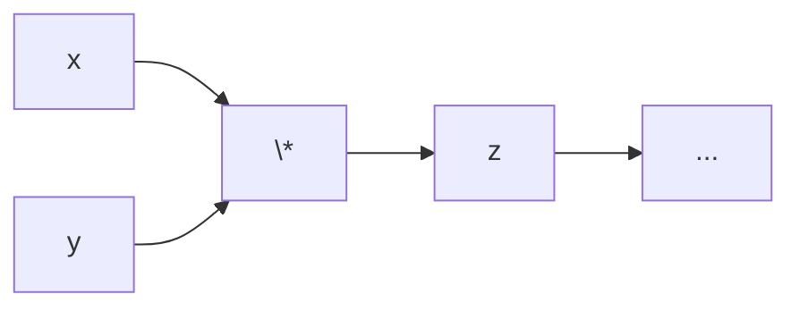
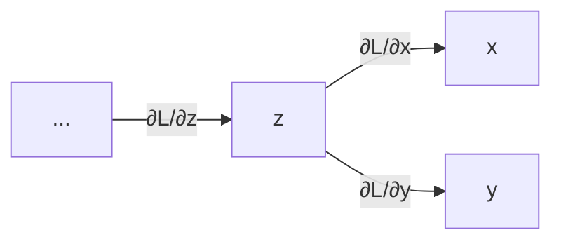
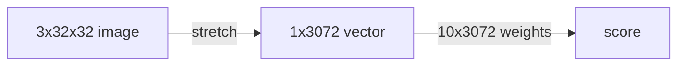
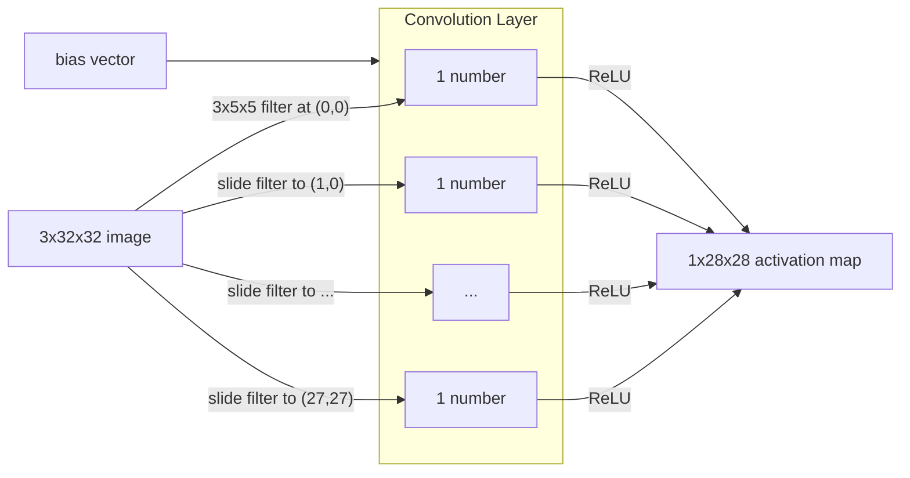
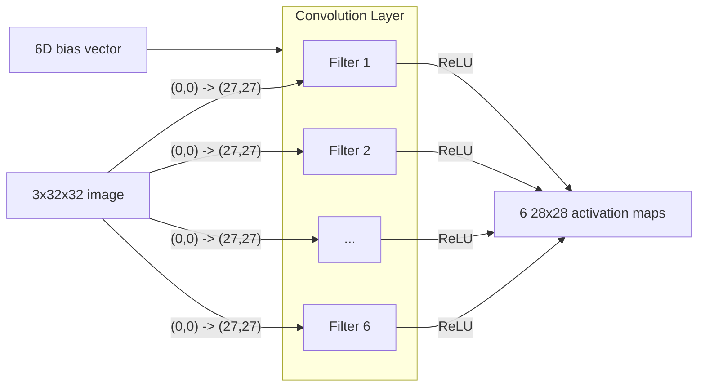
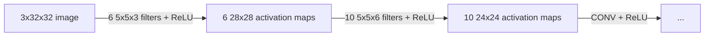

# 1 Convolutional Neural Networks
---
## Convolution

Mathematical Intuition

### Kernel (Filter)

### Slide

---
## Convolutional Neural Networks
### Perceptron → Linear Classifier

**Linear Classifier** is a modern use of **Perceptron** for mapping image features to multiple categories.

### Classifier (Score Function)

Linear Boundary:

$$
s_{x_i} = f(x_i, W) = Wx_i
$$

### Loss Function

Cross-Entropy + softmax

$$
L_i = - \log \frac{\exp(s_{y_i})}{\sum_j \exp(s_j)}
$$

- Regularisation Loss (L2):

$$
R(W) = \lambda ||W||^2
$$

- Full Loss:

$$
L = \frac{1}{N} \sum_{i=1}^{N} L_i + R(W)
$$

### Optimisation

**RMSProp**: Dynamically adjust learning rates of different gradients.

Maintain weighted average square of gradients:

$$
E[g^2] \gets \beta E[g^2] + (1 - \beta)g^2
$$

Update parameters:

$$
W \gets W - \frac{\alpha}{\sqrt{E[g^2]}+\epsilon}g
$$

---
### Linear Classifier → Fully-Connected Networks

### Activate Function 

Loss of hidden layers:

$$
L_i = \sum_{j \ne y_i} \max (0, s_j - s_{y_i} + 1)
$$

### Backpropagation

Every Node knows its ***Local Gradients***:

$$
z = x \cdot y, \; \textcolor{green}{\frac{\partial z}{\partial x}} = y
$$

It gets ***Upstream Gradient*** from the next layer:

$$
\textcolor{red}{\frac{\partial L}{\partial z}}
$$

Then, it can get ***Downstream Gradients*** by simply multiplying its local gradients (Chain Rule) and send to the previous layer:

$$
\frac{\partial L}{\partial x} = \textcolor{green}{\frac{\partial z}{\partial x}} \cdot \textcolor{red}{\frac{\partial L}{\partial z}}
$$

---
### FCNs → Convolutional Networks (CNNs)

> [!warning] Key Limitation of FCNs on Computer Vision
> 
> The ***spatial structure*** of images is destroyed.
> 
> - The neurone of FCNs can only process data in **1D vector** structure.
> - An image must be flattened before being passed into the network.
> 
> Outcome:
> 
> - **Pixel Adjacency** is lost
> - **Geometry** and **topology** in images disappear
> 
> This problem is almost **impossible** to be solved in FCNs framework.
> 
> - Re-learn spatial structure is inefficient and requires huge datasets
> - May need too much parameters, causing overfitting and poor generalisation

Solution of CNNs: **Convolution** + **Downsample**

- **Convolution** layers - Extract features with a limited view/filter for respecting 2D image structure.
- **Downsample (Pooling)** layers - Expand receptive field (view) and dropdown resolution for faster computation.
- **Fully-Connected** layers - Form an MLP at the end to predict scores and output categories.

A CNN is a neural network with Convolution layers.

---
## Convolution Layer

*Assume a colour (RGB) image with 32x32 pixels*

**FCNs**

Use *stretch* to transfer an image into a 1D vector.

**Convolution**

- Perform *filters* with a small view (e.g., only care about a local range of pixels, only care about contrast, only care about margin, ...)
- Convolve (slide) over all spatial locations on the image
- Perform activation function (ReLU)
- Store results in an activation map

One Filter:

Multiple Filters:

One Convolution Layer:

- Input: $C_\text{in} \times H \times W$
- Filters: $C_\text{out} \times C_\text{in} \times K_h \times K_w$ 
- Output: $C_\text{out} \times (H - K_h + 1) \times (W - K_w + 1)$

Multiple Convolution Layers:

---
### Padding

Problem1: Feature maps **shrink** with each layer.

$$
W' = W - K + 1 \lt W
$$

Solution: Add padding around the input before sliding the filter.

- Raw Input: $W \times W$
- Padding: $P$
- Padded Input: $(W+2P) \times (W+2P)$
- Filter: $K \times K$
- Output: $(W - K + 1 + 2P) \times (W - K + 1 + 2P)$

If selected $P \ge K$, the maps won't shrink anymore.

---
### Receptive Fields

