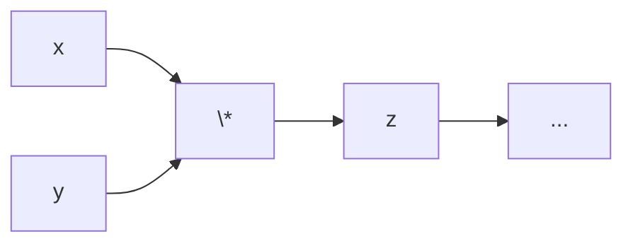
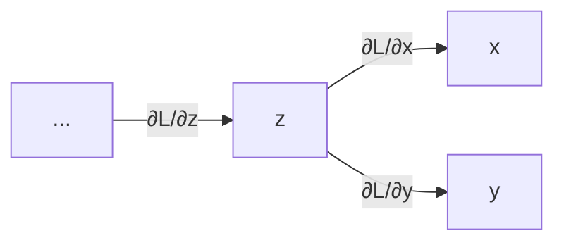
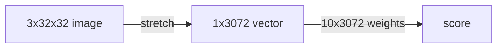
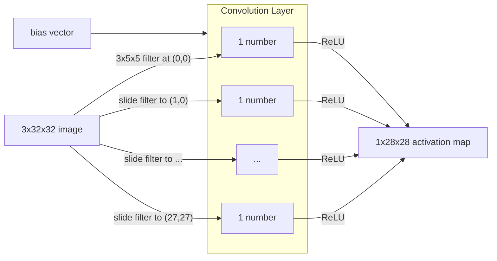
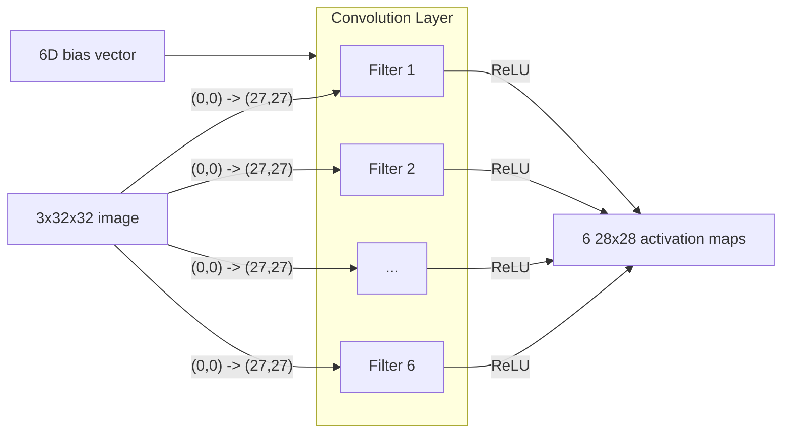
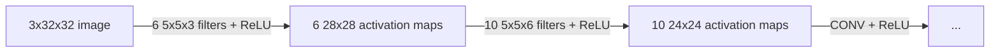

# 1 Convolutional Neural Networks
---
## Convolution

Convolution = Local weighted sum

$$
O[x, y] = \sum_{i,j} I[x+i,\; y+j]\;K[i,j]
$$

Where

- $I$ - Select a **local patch** of the image
- $K$ - Multiply each value by the **local weights** defined in the kernel (filter/pattern)
- $(x,y)$ - Sum them to obtain one output value at position

> [!NOTE] What does a *filter* define?
> 
> **1. Local Area**
> 
> Range/Size of the filter = definition of **locality**.
> 
> - 3×3 kernel → observes a 3×3 neighbourhood  
> - 5×5 kernel → observes a 5×5 neighbourhood  
> 
> **2. Local Weights**
> 
> The kernel values ($K[i,j]$) themselves define the **weights** for combining the local pixels.
> 
> - Edge filter → positive + negative values  
> - Blur filter → uniform weights  

To make the computation more machine-friendly, we can:

- **Build** a filter
- **Slide** - Scan (apply such filter to) the input with a local rule
- **Form** the results into a new map

> [!example]- Sobel Horizontal Filter
> 
> **Input**
> 
> $$
> I =
> \begin{bmatrix}
> 1 & 2 & 3 & 2 & 1 \\
> 2 & 4 & 5 & 4 & 2 \\
> 3 & 5 & 8 & 5 & 3 \\
> 2 & 4 & 5 & 4 & 2 \\
> 1 & 2 & 3 & 2 & 1
> \end{bmatrix}
> $$
> 
> **Kernel**
> 
> Detects **horizontal edges**:
> 
> $$
> K =
> \begin{bmatrix}
> 1 & 2 & 1 \\
> 0 & 0 & 0 \\
> -1 & -2 & -1
> \end{bmatrix}
> $$
> 
> - Top row = positive weights  
> - Bottom row = negative weights  
> - Measures intensity change in **vertical direction** → highlights **horizontal boundaries**
> 
> **Convolution**
> 
> Compute the first output pixel \(O[0,0]\)
> 
> - Patch covered by kernel:
> 
> $$
> \begin{bmatrix}
> 1 & 2 & 3 \\
> 2 & 4 & 5 \\
> 3 & 5 & 8
> \end{bmatrix}
> $$
> 
> - Multiply element-wise:
> 
> $$
> \begin{aligned}
> O[0,0] &= 
> (1\cdot1 + 2\cdot2 + 3\cdot1) \\
> &\quad + (2\cdot0 + 4\cdot0 + 5\cdot0) \\
> &\quad + (3\cdot(-1) + 5\cdot(-2) + 8\cdot(-1))
> \end{aligned}
> $$
> 
> - Compute:
> 
> $$
> O[0,0] = (1 + 4 + 3) + 0 + (-3 -10 -8) = -13
> $$
> 
> After sliding the kernel across all positions:
> 
> $$
> O =
> \begin{bmatrix}
> -13 & -16 & -13 \\
> 0 & 0 & 0 \\
> 13 & 16 & 13
> \end{bmatrix}
> $$
> 

Outcomes tell us:

- Where the pattern occurs  
- How strongly it appears  
- How it varies across space  

---
## Perceptron → Linear Classifier

**Linear Classifier** is a modern use of **Perceptron** for mapping image features to multiple categories.

### Classifier (Score Function)

Linear Boundary:

$$
s_{x_i} = f(x_i, W) = Wx_i
$$

### Loss Function

Cross-Entropy + softmax

$$
L_i = - \log \frac{\exp(s_{y_i})}{\sum_j \exp(s_j)}
$$

- Regularisation Loss (L2):

$$
R(W) = \lambda ||W||^2
$$

- Full Loss:

$$
L = \frac{1}{N} \sum_{i=1}^{N} L_i + R(W)
$$

### Optimisation

**RMSProp**: Dynamically adjust learning rates of different gradients.

Maintain weighted average square of gradients:

$$
E[g^2] \gets \beta E[g^2] + (1 - \beta)g^2
$$

Update parameters:

$$
W \gets W - \frac{\alpha}{\sqrt{E[g^2]}+\epsilon}g
$$

---
## Linear Classifier → Fully-Connected Networks

### Activate Function 

**Goal**: Introduce ***non-linearities*** to the model.

$$
\underbrace{\text{Linear Operators} \to \textcolor{red}{\text{Activate Function}}}_{\text{Feedforward/Linear Layer, Convolutional Layer, etc.}} \to \ldots
$$

**Sigmoid**

$$
\sigma(x) = \frac{1}{1+e^{-x}}
$$
$$
L_i = \sum_{j \ne y_i}\big[1-\sigma(s_{y_i}-s_j)\big]
$$

> [!NOTE] Outcome of Sigmoid
> 
> - Squash numbers to range $[0, 1]$
> - Nice interpretability as a saturating "firing rate" of a biological neurone (historically popular) ✅
> - Large positive/negative values can easily "kill" the gradients ❌

**ReLU** (Rectified Linear Unit)

$$
L_i = \sum_{j \ne y_i} \max (0, s_j - s_{y_i} + 1)
$$

> [!NOTE] Outcome of ReLU
> 
> - Does not saturate ✅
> - Very computationally efficient ✅
> - Converges much faster than sigmoid in practice ✅
> - $\mu \ne 0$ ⚠️
> - Dead when all $x < 0$ ❌

**GELU** (Gaussian Error Linear Unit)

$$
\Phi(x) = \frac{1}{\sqrt{2\pi}}\int_{-\infty}^x \,e^{-t^2/2}\,dt
$$

$$
\text{GELU}(x) = x\,\Phi(x)
$$

$$
L_i = \sum_{j \ne y_i} \text{GELU}(1 - (s_{y_i}-s_j))
$$

> [!NOTE] Outcome of GELU
> 
> - Very nice behaviour around 0 ✅
> - Smoothness facilitates training in practice ✅
> - Higher computational cost than ReLU ☹️
> - partial saturate → Large negative values can still easily "kill" gradients ❌

**Other Activation Function**

$$
\text{Leaky ReLU}(x)=\max(0.1x,\,x)
$$

$$
\text{ELU}(x) =
\begin{cases}
x, & x \ge 0 \\
\alpha(e^x-1), & x \lt 0
\end{cases}
$$

$$
\text{SiLU}(x) = x \cdot \sigma(x)
$$

### Backpropagation

Every Node knows its ***Local Gradients***:

$$
z = x \cdot y, \; \textcolor{green}{\frac{\partial z}{\partial x}} = y
$$

It gets ***Upstream Gradient*** from the next layer:

$$
\textcolor{red}{\frac{\partial L}{\partial z}}
$$

Then, it can get ***Downstream Gradients*** by simply multiplying its local gradients (Chain Rule) and send to the previous layer:

$$
\frac{\partial L}{\partial x} = \textcolor{green}{\frac{\partial z}{\partial x}} \cdot \textcolor{red}{\frac{\partial L}{\partial z}}
$$

---
## FCNs → Convolutional Networks (CNNs)

> [!warning] Key Limitation of FCNs on Computer Vision
> 
> The ***spatial structure*** of images is destroyed.
> 
> - The neurone of FCNs can only process data in **1D vector** structure.
> - An image must be flattened before being passed into the network.
> 
> Outcome:
> 
> - **Pixel Adjacency** is lost
> - **Geometry** and **topology** in images disappear
> 
> This problem is almost **impossible** to be solved in FCNs framework.
> 
> - Re-learn spatial structure is inefficient and requires huge datasets
> - May need too much parameters, causing overfitting and poor generalisation

Solution of CNNs: **Convolution** + **Downsample**

- **Convolution** layers - Extract features with a limited view/filter for respecting 2D image structure.
- **Pooling** layers (**Downsample**) - Expand receptive field (view) and dropdown resolution for faster computation.
- **Fully-Connected** layers - Form an MLP at the end to predict scores and output categories.

A CNN is a neural network with Convolution layers.

---
## Convolution Layer

*Assume a colour (RGB) image with 32x32 pixels*

**FCNs**: Use *stretch* to transfer an image into a 1D vector.

**Convolution**:

- Perform *filters* with a small view (e.g., only care about a local range of pixels, only care about contrast, only care about margin, ...).
- Convolve (slide) over all spatial locations on the image.
- Perform activation function (ReLU).
- Store results in an activation map.

One Filter:

Multiple Filters:

One Convolution Layer:

- Input: $C_\text{in} \times H \times W$
- Filters: $C_\text{out} \times C_\text{in} \times K_h \times K_w$ 
- Output: $C_\text{out} \times (H - K_h + 1) \times (W - K_w + 1)$

Multiple Convolution Layers:

---
### Padding

*Problem* - Feature maps **shrink** with each layer.

$$
W' = W - K + 1 \lt W
$$

*Solution* - Add padding around the input before sliding the filter.

- Raw Input: $W \times W$
- Padding: $P$
- Padded Input: $(W+2P) \times (W+2P)$
- Filter: $K \times K$
- Output: $(W - K + 1 + 2P) \times (W - K + 1 + 2P)$

**Same Padding**: In practice, we use padding to keep the output size the same as the input size.

$$
P = \frac{K - 1}{2}
$$

---
## Downsampling

### Pooling

*Problem* - **Translation Variance**

The visual features should not depend on absolute coordinates

$$
\text{Conv}(\text{Translate}(X)) = 
\text{Translate}(\text{Conv}(X))
$$

**Translation Variance**: A slight spatial shift in the input image may produce significant variations in the resulting feature map, leading to instability in the classifier’s predictions.

*Solution* - Downsample by applying a pool filter with a fixed sampling rule.

**Max Pool**

$$
O[i,j]=\max_{u,v \in R} I[u,v]
$$

**Average Pool**

$$
O[i,j]=\frac{1}{|R|}\sum_{u,v \in R}I[u,v]
$$

where

- $R$ - View of the pool filter

### Stride

*Problem* - Convolution operator cost a lot.

$$
\text{ConvOps}_{S=1} = (W - K + 2P +1)^2
$$

*Solution* - Downsample by increasing the **Stride**.

- Not continuously slide the filter ($S = 1$) anymore, but step with a distance ($S \ge 2$)).

$$
\text{ConvOps}_{S} = (\frac{W - K + 2P}{S} +1)^2
$$

Modern CV designs (ResNet, MobileNet) use strided convolution instead of pooling.

> [!faq]- Why strided convolution is replacing pooling?
> 
> - **Learnable downsampling** — Stride reduces spatial size _while learning_ how to combine features, unlike fixed max/avg rules.
> - **Better information preservation** — Pooling discards details abruptly; stride can preserve meaningful structure.
> - **End-to-end optimisation** — Stride integrates into convolution layers, making the whole pipeline differentiable and more stable.
> - **Cleaner architecture** — Fewer separate layers

> [!tip] Summary
> 
> Input: $C_{in} \times H\times W$
> 
> Hyperparameters:
> - Kernel size: $K_H\times K_W$
> - Number filters: $C_{out}$
> - Padding: $P$
> - Stride: $S$
> 
> Weight matrix: $C_{out} \times C_{in} \times K_H\times K_W$
> 
> Bias vector:  $C_{out}$
> 
> Output size: $C_{out} \times H'\times W'$ 
> 
> where:
> 
> - $H'=\frac{H-K+2P}{S}+1$
> - $W'=\frac{W-K+2P}{S}+1$

> [!info]- Common Settings
> 
> - $K_H=K_W$ (Small square filters)
> - $P=\frac{K-1}{2}$ (Same padding)
> - $C_{in}, C_{out} =32,64,128,256$ (powers of 2)
> - $K=3,P=1,S=1$ (3×3 Filter)
> - $K=5,P=2,S=1$ (5×5 Filter)
> - $K=1,P=0,S=1$ (1×1 Filter)
> - $K=3,P=1,S=2$ (Downsample by 2)

---
## Normalisation Layer

### Normalise

*Motivation* - Stabilise the **Internal Covariate Shift** by applying activate functions between layers, which causes

- unstable gradients
- slower convergence
- more difficulty in optimising deep models

For each input vector:

$$
\hat{x}_i = \frac{x_i-\mu}{\sigma+\varepsilon}
$$

- Outcome: $\bar{x} = 0$, $s^2_x = 1$.

> [!faq] What is the statistical dimension of $i$
> 
> - Batch Norm: $H, W, N$ - normalise between samples
> - Layer Norm: $H, W, C$ - normalise between channels
> - Instance Norm: $H, W$ - normalise per sample per channel
> - Group Norm:  $H, W, c$ - Divide channels into groups
> 
> *Channel = Depth/Features per pixel*

---

### Affine Transform

*Problem* -  Directly use normalising will **restricts the representational capacity** of the network, which makes the model CANNOT:

- change the **scale** of the feature
- **shift** the activation distribution
- preserve important **magnitude information**

*Solution* - Introduce learnable parameters specifically for **optimising distribution** of original data.

$$
y_i = \gamma \hat{x}_i + \beta
$$

- Outcome: $\bar{x} = \beta^\ast$, $s^2 = \gamma^\ast$.
- If the original distribution is optimal, then:

$$
\gamma = \sigma,\; \beta = \mu
$$

---

### Dropout

*Problem* - Overfitting from **co-adaption** of features:

- A group of Neurones work at same time
- Limited generalisation even scaling up the network
- Zero Training Loss but high validation loss

*Solution* - For each step, randomly (by a hyperparameter) dropout (block) some neurones (set to zero probability).

Drop at training time (Forward Propagation):

$$
\text{Conv} \to \text{GELU} \to \textcolor{red}{\text{Dropout}} \to \text{Next Layer}
$$

- Sample a binary mask $m_i \in \{0, 1\}$ with $p$ (often 0.5)

$$
m_i \sim \text{Bernoulli}(p)
$$

- *Original Dropout* (rarely used)

$$
\tilde{x}_i = m_i \cdot x_i
$$

- *Inverted Dropout*

$$
\tilde{x}_i = \frac{m_i}{p} x_i
$$

Scale at test time:

$$
\text{Output at test time} = \text{Expected output at training time}
$$

- *Original Dropout* - Output of neurone $\ast \,p$
- *Inverted Dropout* - No additional steps required

> Not necessary (even not commonly used) in CNN architectures.

---
