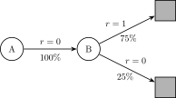

# 10 Value Function Approximation
---
## Tabular Representation → Function Representation

Tabular Presentation:

- All values/policies are discrete and stored in a table
- We update values by change it directly

Function Presentation:

- We construct a function for fitting the value distribution
- We update value by tuning parameters of the function

| Aspect               | Tabular                                | Function Approx.                                              |
| -------------------- | -------------------------------------- | ------------------------------------------------------------- |
| **Interpretability** | ✅Intuitive                             | ❌Hard to interpret                                            |
| **Scalability**      | ❌Difficult for large/continuous spaces | ✅Much fewer memories required                                 |
| **Generalisability** | ❌Poor                                  | ✅Generalises from seen situations to unseen situations        |
| **Bias**             | ✅Accurate when state space is small    | ⚠️**Biased** \- State values cannot be represented accurately |

---
## Function Approximation

Approximate value function by constructing a new function and tuning parameters $w$.

- *instead of a table ($s$-$a$) of discrete values (tabular)*

$$
\begin{align}
\hat{v}(s, {\color{red}{\mathbf{w}}})\; & {\color{red}{\approx}}\; v_{\pi}(s)\\[0pt]
\;\;\;\hat{q}(s, a, {\color{red}{\mathbf{w}}})\; & {\color{red}{\approx}}\; q_{\pi}(s, a)
\end{align}
$$

---
## Object Function

Goal: $minimise$ *MSE* between approx function and true value function.

$$
J(\mathbf{w}) = \mathbb{E}_\pi \left[ (v_\pi(S) - \hat{v}(S, \mathbf{w}))^2 \right]
$$

where $S \in \mathcal{S}$ - the state is a *Random Variable* which follows the probability distribution, e.g.:

- **Uniform Distribution**
	- All with the same probability
	- $S = \frac{1}{|\mathcal{S}|}$
	- ❌Too simple; not practical
- **Stationary Distribution**
	- Describe the long-term behaviour of a Markov process
		- $d_\pi(s) \approx \frac{N(s)}{\sum_{s \in \mathcal{S}} N(s)}$
	- Which can also be predicted by using $P$ from a model (MDP)
		- $d_\pi = d_\pi P$
	- ✅Stationary; can be learned

---
## Optimise the Object Function

By using Gradient Descent:

$$
w_{k+1} = w_k - \alpha \nabla J(w_k)
$$

$\nabla J(w_k)$ can be computed by:

- **Ture Gradient Descent**
	- need to calculate the expectation (collect all $N$ samples), not practical❌

$$
\begin{align}
\nabla J(w)
& = \nabla \mathbb{E} \left[ (v_\pi(S) - \hat{v}(S, w))^2 \right] \\[0pt]
& \propto \mathbb{E}[(v_\pi(S)-\hat{v}(S,w))\,\nabla\hat{v}(S,w)]
\end{align}
$$

- **Stochastic Gradient Descent**
	- Use only 1 sample $s_t$ 
	- Online update, better generalisation✅

$$
\nabla J(w) \approx
\bigl(v_\pi(s_t) - \hat{v}(s_t,w_t)\bigr) \,
\nabla \hat{v}(s_t,w_t)
$$

For remaining two terms:

- $\nabla\hat{v}(s_t,w_t)$ ← Feature Vectors (Linear)
- $v_\pi(s_t)$ ← Value Function Approximation

---
## Approximate the Value Function
### Feature Vectors

Represent the state by a feature of vectors $\mathbf{x}(s)$, so that in **linear case**:

- State-value Gradient:

$$
\nabla\hat{v}(s,w) = \frac{\partial \hat v(s)}{\partial w} = \mathbf{x}(s)
$$

- State-action-value Gradient:

$$
\nabla \hat q(s,a,w) = \mathbf{x}(s,a)
$$

- Intuitive; easy to implement; high interpretability✅
- Difficult to select appropriate feature vectors⚠️

---
### State-value Approximator

#### Derive from Monte Carlo

Use $g_t$ (discounted return starting from $s_t$) to approximate:

$$
v_\pi(s_t) = g_t
$$

- converges to a local optimum, even for _non-linear_ approximation

---
#### Derive from Temporal Difference

Use $r_{t+1} + \gamma \hat v(s_{t+1}, w_t) - \hat{v}(s_t, w_t)$ (TD Error) to update approximator at each step:

$$
v_\pi(s_t) = r_{t+1} + \gamma \hat v(s_{t+1}, w_t)
$$

- Linear TD(0) converges close to the global optimum

---
#### Derive from TD(λ)

- Forward View:

$$
v_\pi(s_t) = g_t^\lambda
$$

- Backward View: 

$$
\begin{align}
\delta_t & = r_{t+1} + \gamma \hat v(s_{t+1}, w_t)-\hat{v}(s_t, w_t) \\[4pt]
E_t & = \gamma \lambda E_{t-1} + \nabla\hat{v}(s_t,w_t) \\[4pt]
w_{k+1} &= w_k - \alpha \, \delta_t \, E_t
\end{align}
$$

---
### Action-state-value Approximator

Generally change $v$ to $q$ :

$$
w_{k+1} = w_k 
- \alpha\,
\bigl(q_\pi(s_t,a_t)-\hat{q}(s_t,a_t,w_t)\bigr)\,
\nabla \hat{q}(s_t,a_t,w_t)
$$

#### Derive from Monte Carlo

$$
q_\pi(s_t,a_t) = g_t
$$

#### Derive from Sarsa

$$
q_\pi(s_t,a_t) = r_{t+1} + \gamma \hat{q} (s_{t+1}, a_{t+1}, w_t)
$$

#### Derive from TD(λ)

- Forward View:

$$
q_\pi(s_t, a_t) = g_t^\lambda
$$

- Backward View: 

$$
\begin{align}
\delta_t & = r_{t+1} + \gamma \hat q(s_{t+1}, a_{t+1}, w_t)-\hat{q}(s_t, a_t, w_t) \\[4pt]
E_t & = \gamma \lambda E_{t-1} + \nabla\hat{q}(s_t,a_t,w_t) \\[4pt]
w_{k+1} &= w_k - \alpha \, \delta_t \, E_t
\end{align}
$$

#### Derive from Q-learning

$$
q_\pi(s_t,a_t) = r_{t+1} + \gamma \max_{a \in \mathcal{A}(s_{t+1})}\hat{q} (s_{t+1}, a, w_t)
$$

---
## Batch

**Restricted Environment**: Only limited and static samples can algorithms learn from

$$
\mathcal{D} = \{\langle s_1, v^\pi_1 \rangle, \ldots, \langle s_n, v^\pi_n \rangle\}
$$

**Distribution Shift**: These samples may generate by a sub-optimal policy, so that:
- Data may be out of distribution
- Q-value may be over-estimated
- Overfitting

**Potential Suitable Methods:**
- Function Approximation → generalisability
- Off-policy (e.g. Q-Learning) → static sample set
- Supervised Learning Methods (e.g. Neural Network) → static sample set

---
##### Example - MC & TD In a Batch

Sampled Episodes: 8 Samples (Limited)

$$
\begin{align}
A \to 0, B \to 0 \\
B \to 1 \\
B \to 1 \\
B \to 1 \\
B \to 1 \\
B \to 1 \\
B \to 1 \\
B \to 0
\end{align}
$$

MC Update:

- $v(B) = 6/8 = 0.75$
- $v(A) = 0 / 1 = 0$

TD Update:

- $v(B) \to 0.75$
- $v(A) = 0 + v(B) \to 0.75$

---
## Batch Methods

### Least Squares Solution

By $minimising$ *SSE* between approximate and true values:

$$
LS(w_i) = \mathbb{E} \left[ (v^\pi(S) - \hat{v}(S, w))^2 \right]
$$

- True values can be approximated by Return (MC) or Temporal Difference (TD)
- Using all samples at once
- $O(n^3)$ or $O(n^2)$ by using "Sherman-Morrison"

---
### Stochastic Gradient Descent

By randomly sample a mini-batch of samples from $\mathcal{D}$:

$$
\mathcal{B} = \{\langle s_1, v^\pi_1 \rangle, \ldots, \langle s_k, v^\pi_k \rangle\}
$$

Then use gradient descent for updating:

$$
w_{k+1} = w_k - \alpha\,
\frac{1}{m} \sum_{\langle s_i, v^\pi_i \rangle \in \mathcal{B}}
\bigl( v^\pi_i(s_i) - \hat{v}(s_i, w_i) \bigr)
\nabla \hat{v}(s_i, w_i)
$$

---
### Deep Q-Learning

By using Q-Learning + Neural Network ($minimise$ MSE $\mathbf{Loss}(\cdot)$): 

$$
\mathbf{Loss}(w_i)
=\underbrace{\mathbb{E}_{(s,a,r,s')\sim \mathcal{D}_i}}_{\text{sampled from}\;D_i}
\Big[
\big(
\underbrace{r+\gamma \max_{a'} Q(s',a';w_i^-)}_{\text{TD target }}
-
\underbrace{Q(s,a;w_i)}_{\text{Q estimate}}
\big)^2
\Big]
$$

- Experience replay: 
	- Randomly sample from non-i.i.d data → single sample/mini-batch
	- ✅For decorrelation (near-i.i.d)
- Fixed Q-targets: 
	- $w_i^-$ will only be updated by $w_i$ (lively updated) after running a while (like 1000 steps)
	- ✅Reduce variance