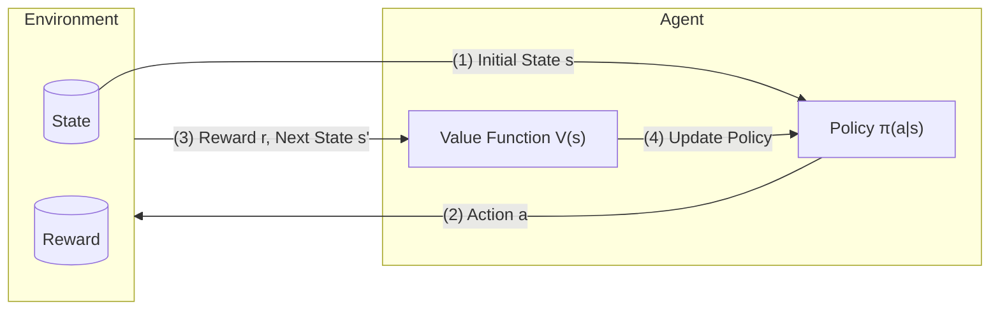

# 6. Reinforced Learning
---
## Reinforced Learning
- Policy + Reward + Trial-and-error Interaction

### Planning vs Learning

| Dimension                         | **Planning**                                                      | **Learning**                                                                                |
| --------------------------------- | ----------------------------------------------------------------- | ------------------------------------------------------------------------------------------- |
| **Environment Model**             | Model is **known**                                                | Model is **unknown**                                                                        |
| **Learning Mode**                 | Offline computation                                               | Online trial-and-error                                                                      |
| **Agent–Environment Interaction** | No interaction with the real environment; uses internal simulator | Must act in the real environment to gather experience                                       |
| **Policy Improvement**            | Through search, deliberation,  planning and introspection         | Through reward-driven learning                                                              |
| **Suitable Scenarios**            | A precise model exists and simulation is cheap                    | The model is unknown or hard to specify                                                     |
| **Advantages**                    | Safe, interpretable, no real-world risk                           | Adaptive, risky working in complex/unknown environments                                     |
| **Disadvantages**                 | Requires accurate model; modeling may be expensive                | Requires exploration; may be costly or risky                                                |
| Example - Atari Game              | Agent can query emulator for perfect model (source code)          | Agent can only sees pixels and scores on the screen → trial-and-error gameplay is necessary |

### RL vs. Planning vs. Other ML

| Dimension                      | Reinforcement Learning                                            | Automated Planning                             | Other ML                                                     |
| :----------------------------- | :---------------------------------------------------------------- | :--------------------------------------------- | :----------------------------------------------------------- |
| **Action Outcomes**            | **Non-deterministic** — actions lead to probabilistic transitions | Deterministic — outcome fully known from model | Usually not modelled as sequential decisions                 |
| **Environment Representation** | **Probabilistic model** of states, transitions, and rewards       | Symbolic or logical model (e.g., STRIPS)       | No explicit environment                                      |
| **Learning Signal**            | **Reward Signal** - Feedback from environment                     | Predefined goal or planner objective           | Labels or self-structures                                    |
| **Data Structure**             | **Sequential / Time series** (non-i.i.d.)                         | Discrete steps in a planning domain            | Often i.i.d. samples (independent & identically distributed) |
| **Search & Optimisation**      | Trail-and-error search + Reward-driven                            | state-space search + Predefined policy         | Gradient-based or statistical fitting                        |
| **Credit Assignment**          | **Required** — reward may be delayed over time                    | Not relevant — goal known a priori             | **Not Required** - no delay                                  |

##### Example - Common Applications
- Making a humanoid robot walk
- Fine tuning LLMs using human/AI feedback
- Optimising operating system routines
- Controlling a power station
- Managing an investment portfolio

---
## Reinforced Learning Process

---
## Environments

### State - $S, P$
- All RL Algorithms assume that State is Markov:
	$$
	P(s' \mid s + H(s), a) = P(s' \mid s, a)
	$$
	
	- Once $S$ is known, $H$ can be thrown away
- Any RL problem can be made Markov by expanding the state
	- Add history into the current state
	- Add belief state (POMDP → belief-MDP)
	- Add latent state (Model-based RL)

---
### Reward - $R$
- A scalar feedback signal
- Indicates how well agent is doing at one step
- **Reward Hypothesis**
	- _All_ goals can be described by the $maximisation$ of expected cumulative reward

---
## Agents

- **Prediction**: Evaluate the future rewards of state-actions
	- → *Value Function*
- **Control**: Find the optimal policy
	- → *Policy Function*

---
### Model - Latent $P, R$

- An internal simulator for predicting what the environment will do next
	- Transition Model: $P(s' \mid s,a)$
	- Reward Model: $R(s,a) = \mathbb{E}\left[\, R_{t+1} \mid s_t, a \,\right]$
- Simulation is **NOT** necessary for RL 
	- → Model-based/Model-free

---
### Value Function - $V, Q$

- Define and predict values of states based on *the expectation of future rewards*
- State-value Function
	- Output the value of current state
		$$
		V_\pi(s) = \mathbb{E}_\pi\big[G_t \mid S_t = s\big]
		$$

- State-action-value Function
	- Output the value of the current state with a deterministic action applied
		$$
		Q_\pi(s,a) = \mathbb{E}_\pi \big[\, G_t \mid S_t = s,\, A_t = a \,\big]
		$$

---
#### Return - $G_t$
- total discounted reward of the future
	$$
	G_t = R_{t+1} + \gamma (R_{t+2} + \gamma (R_{t+3} + \ldots)) = \sum_{k=0}^{\infty} \gamma^k R_{t+k+1}
	$$

---
#### Bellman Expectation Equation 
- **Bellman Equation**: Gives a recursive form of **Return**
		$$ G_t = R_{t+1} + \gamma G_{t+1} $$
	
	- Based on "*look-ahead then back-up*" computational mechanism
		- **Look-ahead**: to the next step → $r, s'$
		- **Back-up**: to the current state → $v(s) = f(r,s')$

- State-value Function (Deriving BEE)
	$$
	\begin{aligned}
	v_\pi(s)
	&= \mathbb{E}\!\left[r + \gamma v_\pi(s')\right] \\[6pt]
	&= \sum_a \pi(a\mid s)\Bigl[\sum_r p(r\mid s,a)\,r
	   + \gamma \sum_{s'} p(s'\mid s,a) \, v_\pi(s')\Bigr]
	\end{aligned}
	$$

- State-action-value Function (Deriving BEE)
	$$
	\begin{aligned}
	q_\pi(s,a)
	&= \mathbb{E}\!\left[\, r + \gamma\, \mathbb{E}_{a'\sim\pi(\cdot\mid s')} \bigl[q_\pi(s',a')\bigr] \right] \\[6pt]
	&= \sum_{s',r} p(s',r\mid s,a)\left[ r + \gamma \sum_{a'} \pi(a'\mid s')\, q_\pi(s',a') \right]
	\end{aligned}
	$$
	
- Solving the BEE
	- Directly Compute $O(n^3)$
		$$
		v = R + \gamma Pv \to v = (I - \gamma P)^{-1}R
		$$

		- only possible for small $P$ matrix

	- Dynamic Programming
	- Monte-Carlo Evaluation
	- Temporal-Difference Learning

---
#### Discount Factor - $\gamma$

| Gamma ($0 \le \gamma \le 1$) | Behaviour                                    |
| ---------------------------- | -------------------------------------------- |
| $\gamma = 0$                 | Greedy                                       |
| $\gamma \to 0$               | Myopic                                       |
| $\gamma \to 1$               | Far-sighted                                  |
| $\gamma = 1$                 | **Guarantee** only if all sequence terminate |

#### Why Discounting is Used

- **Technical Reasons**
	- Makes modelling and computation easier (Bellman equations converge cleanly)
	- Prevents infinite returns in cyclic Markov processes
	- Reflects uncertainty about far-future outcomes

- **Realistic Reasons**
	- In financial settings, immediate rewards can be reinvested (time value of money)
	- Human and animal behaviour shows preference for immediate rewards over delayed rewards

---
### Policy - $\pi$
- Fully defines agent's behaviour
- **Stationary** (Time-independent) - Only relies on the current state
#### Deterministic Policy 
- Give the best action directly
$$
\pi(a \mid s) = \mathbf{1}\{\, a = a^*(s) \,\}
$$

#### Stochastic Policy 
- Give the probability of each action
$$
\pi(a \mid s) = P(a \mid s)
$$

- Ability of exploration; Robustness✅

#### Explicit Policy
- Construct a model of $\pi$ and optimise its parameters $\theta$.
$$
\pi(a\mid s) = f(Q; \theta)
$$

#### Implicit Policy
- Optimise $Q$, $V$ directly
$$
\pi(a\mid s) = f(Q)
$$

---
### Example - MAZE

- $S$ - Agent's possible locations
- $A$ - Step directions $\mathtt{N, E, S, W}$
- $R$ - $-1$ per time-step (encourage short-path solution)
- $V(s)$ - the expected return of following the policy from each $s$ 
	- closer to $g$ - $V(s)$ ⤴
	- Farther away - $V(S)$ ⤵
- $\pi(s)$ - Best action = Best $V(s')$
- Model
	- **Transition model** $P_{ss'}^a$ - how each action changes the state.
	- **Reward model** $R_{s}^a$ - immediate reward from each state (same for all $a$).
	- The model can be imperfect but supports planning and prediction.

---
### Categories of RL Algorithms
- Model?
	- **Model Based** - Simulate environment to gain first experience 
	- **Model Free** - Gain experience from real interaction directly
- Value-or-Policy?
	- **Value Based** - Implicit Policy
	- **Policy Based** - Not learn Value, learn Policy directly
	- **Actor-Critic** - Policy Based 演员 + Value Based 评论家
