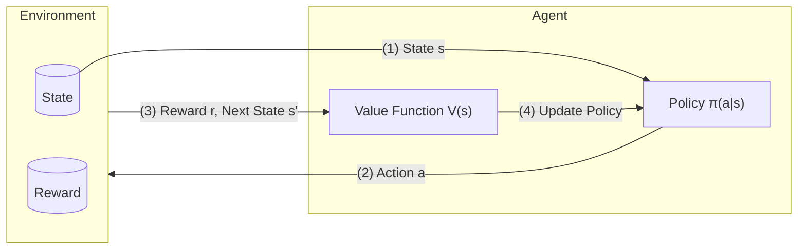

# 6 Reinforced Learning
---
## Reinforced Learning
- Policy + Reward + Trial-and-error interaction

### Planning vs Learning

| Dimension                         | **Planning**                                                      | **Learning**                                                                                |
| --------------------------------- | ----------------------------------------------------------------- | ------------------------------------------------------------------------------------------- |
| **Environment Model**             | Model is **known**                                                | Model is **unknown**                                                                        |
| **Learning Mode**                 | Offline computation                                               | Online trial-and-error                                                                      |
| **Agent–Environment Interaction** | No interaction with the real environment; uses internal simulator | Must act in the real environment to gather experience                                       |
| **Policy Improvement**            | Through search, deliberation,  planning and introspection         | Through reward-driven learning                                                              |
| **Suitable Scenarios**            | A precise model exists and simulation is cheap                    | The model is unknown or hard to specify                                                     |
| **Advantages**                    | Safe, interpretable, no real-world risk                           | Adaptive, risky working in complex/unknown environments                                     |
| **Disadvantages**                 | Requires accurate model; modeling may be expensive                | Requires exploration; may be costly or risky                                                |
| Example - Atari Game              | Agent can query emulator for perfect model (source code)          | Agent can only sees pixels and scores on the screen → trial-and-error gameplay is necessary |

### RL vs. Planning vs. Other ML

| Dimension                      | Reinforcement Learning                                            | Automated Planning                             | Other ML                                                     |
| :----------------------------- | :---------------------------------------------------------------- | :--------------------------------------------- | :----------------------------------------------------------- |
| **Action Outcomes**            | **Non-deterministic** — actions lead to probabilistic transitions | Deterministic — outcome fully known from model | Usually not modelled as sequential decisions                 |
| **Environment Representation** | **Probabilistic model** of states, transitions, and rewards       | Symbolic or logical model (e.g., STRIPS)       | No explicit environment                                      |
| **Learning Signal**            | **Reward Signal** - Feedback from environment                     | Predefined goal or planner objective           | Labels or self-structures                                    |
| **Data Structure**             | **Sequential / Time series** (non-i.i.d.)                         | Discrete steps in a planning domain            | Often i.i.d. samples (independent & identically distributed) |
| **Search & Optimisation**      | Trail-and-error search + Reward-driven                            | state-space search + Predefined policy         | Gradient-based or statistical fitting                        |
| **Credit Assignment**          | **Required** — reward may be delayed over time                    | Not relevant — goal known a priori             | **Not Required** - no delay                                  |
|                                |                                                                   |                                                |                                                              |

##### Example - Common Applications
- Making a humanoid robot walk
- Fine tuning LLMs using human/AI feedback
- Optimising operating system routines
- Controlling a power station
- Managing an investment portfolio

---
## Reinforced Learning Process

---
## Environments

### State - $S, P$
- All RL Algorithms assume that State is Markov:
	$$
	P(s' \mid s + H(s), a) = P(s' \mid s, a)
	$$
	
	- Once $S$ is known, $H$ can be thrown away

---
### Reward - $R$
- A scalar feedback signal
- Indicates how well agent is doing at one step
- **Reward Hypothesis**
	- _All_ goals can be described by the $maximisation$ of expected cumulative reward

---
## Agents

- **Prediction**: Evaluate the future rewards of state-actions
	- → *Value Function*
- **Control**: Find the optimal policy
	- → *Policy Function*

---
### Model - $P, R$

- An internal simulator for predicting what the environment will do next
	- Transition Model: $P(s' \mid s,a)$
	- Reward Model: $R(s,a) = \mathbb{E}\left[\, R_{t+1} \mid s_t, a \,\right]$
- Simulation is **NOT** necessary for RL 
	- → Model-based/Model-free

---
### Value Function - $V, Q$

- Define and predict values of (current and future) states
	- by using the expectation of rewards
- State-value Function
	- Return the value of current state
		$$
		V(s_t) = \mathbb{E}\big[G_t \mid s_t\big]
		$$

- State-action-value Function
	- Return the value of the current state with a deterministic action applied
		$$
		Q_\pi(s_t,a) = \mathbb{E}_\pi \big[\, G_t \mid s_t,\, a \,\big]
		$$

- $G_t$ - the total discounted reward from time-step $t$
	$$
	G_t = R_{t+1} + \gamma R_{t+2} + \ldots = \sum_{k=0}^{\infty} \gamma^k R_{t+k+1}
	$$
	
- Value function is **NOT** necessary for RL 
	- → Value-based Model/ Policy-based Model

---
### Discount Factor - $\gamma$

| Gamma ($\gamma \ge 0$) | Behaviour                                    |
| ---------------------- | -------------------------------------------- |
| $\gamma = 0$           | Greedy                                       |
| $\gamma \to 0$         | Myopic                                       |
| $\gamma \to 1$         | Far-sighted                                  |
| $\gamma = 1$           | **Guarantee** only if all sequence terminate |

#### Why Discounting is Used

- **Technical Reasons**
	- Makes modelling and computation easier (Bellman equations converge cleanly)
	- Prevents infinite returns in cyclic Markov processes
	- Reflects uncertainty about far-future outcomes

- **Realistic Reasons**
	- In financial settings, immediate rewards can be reinvested (time value of money)
	- Human and animal behaviour shows preference for immediate rewards over delayed rewards

---
### Policy - $\pi$
- Fully defines agent's behaviour
- **Stationary** (Time-independent) - Only relies on the current state

#### Implicit Policy
$$
a = \arg\max_{a} Q(s, a) = \arg\max_{a} \sum^{s'} P(s,a,s') \cdot V(s')
$$

- Compare expectations of all valid actions $\sim$ Brute Force
- Common use in model-based RL

#### Deterministic Policy 
$$
\pi(s) = a
$$

- MRP = MDP + restricted by the deterministic policy

#### Stochastic Policy 
$$
\pi(a \mid s) = P(a \mid s)
$$

- Choose the optimal action or random one with a small probability
- Ability of exploration; Robustness✅

#### Policy Gradient
- Maintain a set of parameters $\theta$ for $maximising$ future rewards
$$
J(\theta) = \mathbb{E}(G) = \sum_{\tau} P(\tau \mid \theta) \, G(\tau)
$$

	- $\tau$ - A full path from initial state to the goal

$$
\begin{aligned}
\nabla J(\theta)
&= \sum_{\tau} \nabla P(\tau \mid \theta) \, G(\tau)
&& \text{(definition of expected return)} \\[4pt]
&= \sum_{\tau} P(\tau \mid \theta) \, \nabla \log P(\tau \mid \theta) \, G(\tau)
&& \text{(apply log-derivative trick)} \\[4pt]
&= \mathbb{E}_{\tau \sim P(\tau \mid \theta)} \big[ \nabla \log P(\tau \mid \theta) \, G(\tau) \big]
&& \text{(convert sum to expectation)} \\[4pt]
&= \mathbb{E}_{\pi_\theta} \big[ \nabla \log \pi_\theta(a \mid s) \, G(\tau) \big]
&& \text{(expand trajectory likelihood)}
\end{aligned}
$$

---
#### Balance Exploration & Exploitation in Policy Design
- **Exploitation** - select currently-known best action
- **Exploration** - try a new action
- **Trade-off Strategies**
	- **ε-greedy** 
		- most time exploitation ($P = 1 - \varepsilon$), little time exploration ($\varepsilon$)
	- **softmax** 
		- set a probability to each action and a temperature $\tau$ to control randomising
			$$
			P(a) = \frac{\exp(Q(a) / \tau)}{\sum_{a'} \exp(Q(a') / \tau)}
			$$

	
	- **Upper Confidence Bound (UCB)** 
		- exploitation + exploration bonus
			$$
			a = \arg\max_a \left( Q(a) + c \sqrt{\frac{\ln t}{N(a)}} \right)
			$$

		
			- $c$ - importance of exploration (**parameter**)
			- $\ln{t}$ - explore more when time goes
			- $N(a)$ - not try too many times on one same action

---
### Example - MAZE

- $S$ - Agent's possible locations
- $A$ - Step directions $\mathtt{N, E, S, W}$
- $R$ - $-1$ per time-step (encourage short-path solution)
- $V(s)$ - the expected return of following the policy from each $s$ 
	- closer to $g$ - $V(s)$ ⤴
	- Farther away - $V(S)$ ⤵
- $\pi(s)$ - Best action = Best $V(s')$
- **Model**
	- **Transition model** $P_{ss'}^a$ - how each action changes the state.
	- **Reward model** $R_{s}^a$ - immediate reward from each state (same for all $a$).
	- The model can be imperfect but supports planning and prediction.

---
### Categories of RL Algorithms
- Model?
	- **Model Based** - Simulate environment to gain first experience 
	- **Model Free** - Gain experience from real interaction directly
- Value-or-Policy?
	- **Value Based** - Implicit Policy
	- **Policy Based** - No Value Function = Policy Gradient
	- **Actor-Critic** - Policy Based 演员 + Value Based 评论家
