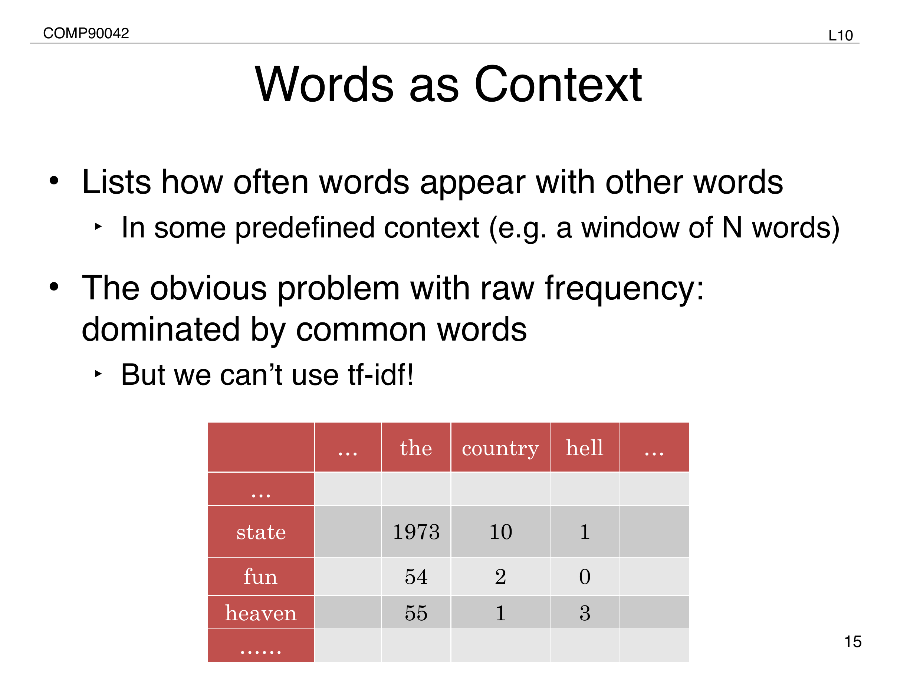
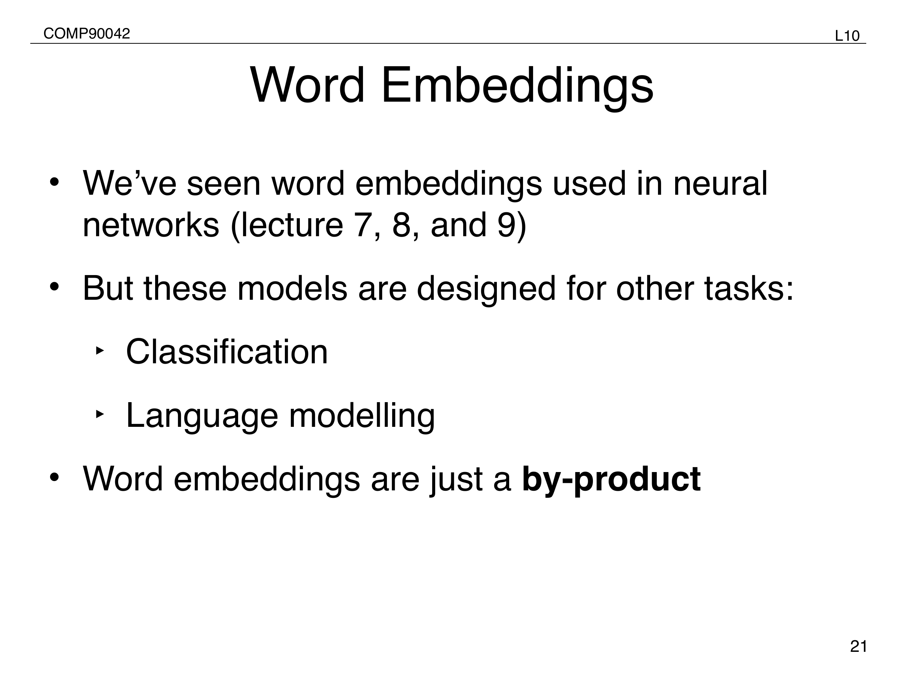
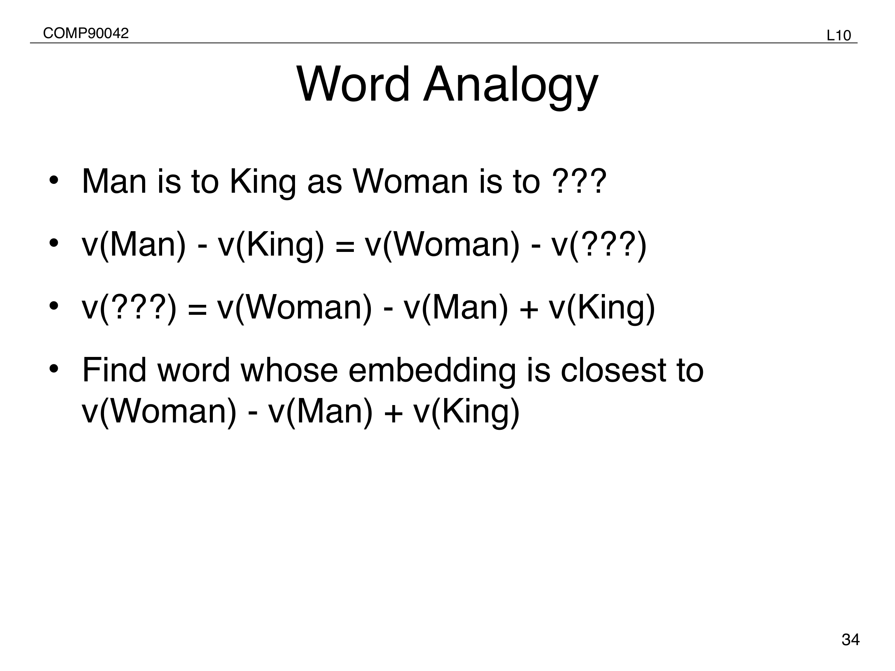

# 08 Word Embeddings

## Big Picture

Word embeddings represent lexical meaning as vectors derived from distributional context. They solve part of the sparsity problem in count-based NLP by letting similar words have similar dense representations, and they become the input layer for later neural models.
<!-- Sources: L10 p.2-37; W6 p.8-15; JM3 Ch.5 -->

## Learning Map

- Prerequisite ideas: vocabulary, co-occurrence counts, matrix representations, probability, and neural classification.
<!-- Sources: L10 p.8-24; W6 p.8-15 -->
- Core concepts: distributional hypothesis, term-document matrices, TF-IDF, SVD, word-context matrices, PMI, Word2Vec, skip-gram, CBOW, negative sampling, and analogy evaluation.
<!-- Sources: L10 p.2-37; W6 p.8-15 -->
- Main procedures: build count matrices, weight co-occurrences, reduce dimensionality, train predictive embeddings, and evaluate similarity or analogies.
<!-- Sources: L10 p.8-37; W6 p.8-15 -->
- Tutorial skills: compute PMI, explain SVD as dense approximation, and distinguish skip-gram from CBOW.
<!-- Sources: W6 p.8-15 -->
- Common traps: assuming raw frequency always indicates semantic association, confusing static and contextual embeddings, or treating analogies as the only evaluation.
<!-- Sources: L10 p.15-37; W7 p.3-4 -->

## Distributional hypothesis

<!-- Figure source: L10 p.15 -->

- Word meaning can be inferred from contextual distribution.
<!-- Sources: L10 p.2 -->
- Document-level context reflects topic association, while local window context reflects finer-grained meaning.
<!-- Sources: L10 p.2 -->

## Count-based vectors

- A term-document matrix can represent either documents by words or words by documents.
<!-- Sources: L10 p.8-9 -->
- TF-IDF downweights words that appear in many documents.
<!-- Sources: L10 p.11 -->
- Sparse count matrices motivate dimensionality reduction to shorter, denser vectors.
<!-- Sources: L10 p.12 -->

| Count-based step | Purpose |
| --- | --- |
| term-document matrix | collect document-level co-occurrence counts |
| TF-IDF weighting | discount very common words |
| SVD / LSA | compress sparse counts into dense lower-dimensional vectors |
<!-- Sources: L10 p.9-14 -->

## Word-context matrices and PMI

- Word-window co-occurrence matrices are dominated by very common words if raw frequencies are used directly.
<!-- Sources: L10 p.15 -->

$$
\mathrm{PMI}(x,y)=\log_2 \frac{P(x,y)}{P(x)P(y)}
$$
<!-- Sources: L10 p.16 -->

- PMI measures how far actual co-occurrence deviates from independence.
<!-- Sources: L10 p.16 -->
- Dense vectors can again be derived after co-occurrence weighting and matrix factorisation.
<!-- Sources: L10 p.19 -->

## Neural embedding methods

- Neural methods can learn embeddings directly rather than only as a by-product of another task.
<!-- Sources: L10 p.21-22 -->
- Desired properties include unsupervised learning and efficient training.
<!-- Sources: L10 p.22 -->

## Word2Vec

<!-- Figure source: L10 p.21 -->

- Skip-gram predicts surrounding words from a target word, while CBOW predicts the target word from surrounding words.
<!-- Sources: L10 p.24 -->

$$
P(c \mid w)
=
\frac{\exp(W_w \cdot C_c)}
{\sum_{u \in V} \exp(W_w \cdot C_u)}
$$
<!-- Sources: L10 p.25-26 -->

- Skip-gram maintains separate target and context embedding matrices.
<!-- Sources: L10 p.26-27 -->

## Negative sampling

- Full softmax training is expensive because it normalises over the full vocabulary.
<!-- Sources: L10 p.28 -->
- Negative sampling reframes learning as binary classification between real word-context pairs and sampled noise pairs.
<!-- Sources: L10 p.28-30 -->

$$
L(\theta)=
\sum_{(w,c)\in +}\log P(+ \mid w,c)
+
\sum_{(w,c)\in -}\log P(- \mid w,c)
$$
<!-- Sources: L10 p.30 -->

## Evaluation

<!-- Figure source: L10 p.34 -->

| Evaluation style | Example |
| --- | --- |
| word similarity | cosine similarity against judged pairs such as WordSim-353 or SimLex-999 |
| word analogy | vector arithmetic such as `woman - man + king` |
| downstream evaluation | use embeddings as features or initialise larger models |
<!-- Sources: L10 p.33-36 -->

$$
v(\text{queen}) \approx v(\text{woman}) - v(\text{man}) + v(\text{king})
$$
<!-- Sources: L10 p.34-35 -->

## Main takeaway

- Neural embedding methods generally outperform count-based methods in the summary comparison.
<!-- Sources: L10 p.37 -->
- Pretrained word vectors are useful initialisations for downstream neural models and motivate the later shift toward pretraining whole models.
<!-- Sources: L10 p.36-37 -->

## Tutorial Patterns

| Pattern | What to Recognize | How to Solve | Common Mistake |
| --- | --- | --- | --- |
| PMI calculation | gives counts for two events and co-occurrence | compute probabilities and plug into PMI formula | using raw counts directly inside the log ratio |
| SVD explanation | sparse matrix is too large/noisy | reduce to dense low-rank approximation | saying SVD merely deletes random features |
| Skip-gram vs CBOW | asks prediction direction | skip-gram predicts context from target; CBOW predicts target from context | reversing the two |
| Negative sampling | full softmax is expensive | train real pairs vs sampled noise pairs | treating negatives as all vocabulary words |
<!-- Sources: L10 p.15-30; W6 p.8-15 -->

## Key Comparisons

| Representation | Context type | Vector type | Main limitation |
| --- | --- | --- | --- |
| Term-document counts | document-level topic context | sparse | high dimensional and topic-biased |
| PMI/SVD embeddings | local or document co-occurrence | dense after reduction | depends on count design |
| Word2Vec | predictive local context | dense learned vectors | static word type representation |
| Contextual embeddings | sentence-specific context | token-dependent vectors | requires larger pretrained networks |
<!-- Sources: L10 p.8-37; W7 p.3-4 -->

## Revision Checklist

- [ ] Can state the distributional hypothesis.
- [ ] Can compute PMI from probabilities.
- [ ] Can explain why SVD gives dense lower-dimensional vectors.
- [ ] Can distinguish skip-gram, CBOW, and negative sampling.
<!-- Sources: L10 p.2-37; W6 p.8-15 -->

## Active Recall

1. Why can raw co-occurrence counts overemphasise frequent words?
2. What does a positive PMI value indicate?
3. Why does negative sampling make training more efficient?
4. Why do pretrained word vectors motivate whole-network pretraining?
<!-- Sources: L10 p.15-37; W6 p.8-15 -->

## Glossary

| Term | Meaning |
| --- | --- |
| Distributional hypothesis | Words with similar contexts tend to have similar meanings. |
| TF-IDF | Weighting that discounts words appearing in many documents. |
| PMI | Pointwise mutual information, association beyond independence. |
| Skip-gram | Word2Vec objective predicting context from a target word. |
| CBOW | Word2Vec objective predicting a target word from context. |
<!-- Sources: L10 p.2-37; W6 p.8-15 -->
