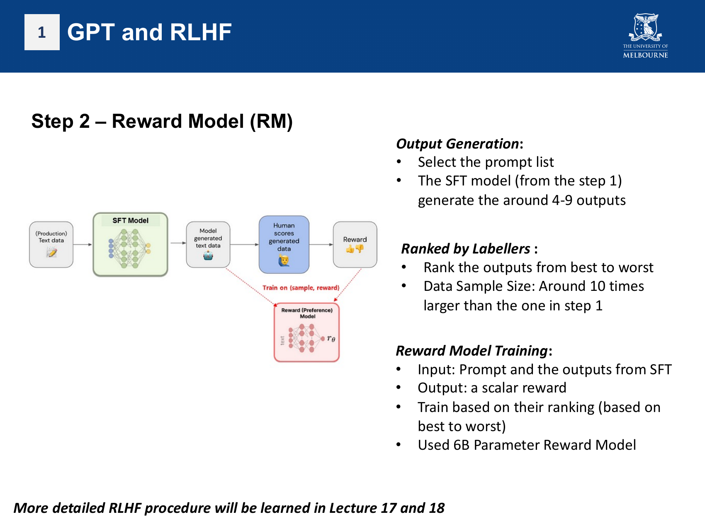
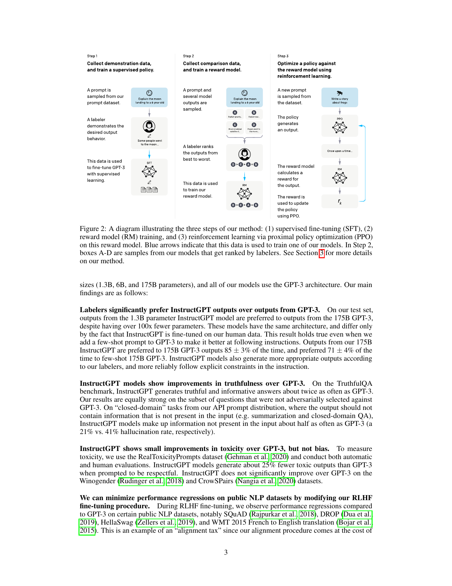

# 13 RLHF and Alignment

## Big Picture

Reinforcement learning from human feedback addresses the gap between the next-token prediction objective and the user-facing objective of producing helpful, honest, and harmless responses. The lecture introduces RLHF as the route from GPT-3 to InstructGPT and ChatGPT, with more detail planned for later lectures.
<!-- Sources: L12 p.45-50; L13-L14 p.10-21; Ouyang 2022 abstract, Sec.1 -->

This note is reading-backed because L17-L18 slides are not currently in the repository. The current lecture evidence comes from L12 and L13-L14 previews of RLHF.
<!-- Sources: L12 p.45-50; L13-L14 p.10-21 -->

## Learning Map

- Prerequisite ideas: GPT-3, prompting, supervised fine-tuning, reward models, and reinforcement learning.
<!-- Sources: L13-L14 p.10-21; Ouyang 2022 abstract, Sec.1 -->
- Core concepts: alignment, supervised fine-tuning, reward model training, human ranking, and PPO.
<!-- Sources: L13-L14 p.14-20; Ouyang 2022 abstract, Sec.1 -->
- Main procedure: collect demonstrations, train an SFT model, collect ranked model outputs, train a reward model, then optimise the policy using PPO against that reward model.
<!-- Sources: L13-L14 p.14-20; Ouyang 2022 abstract, Sec.1 -->
- Common traps: assuming larger LMs automatically follow intent, or treating RLHF as only a safety filter after generation.
<!-- Sources: Ouyang 2022 abstract, Sec.1 -->

## Core Concepts

### Alignment problem

<!-- Figure source: L13-L14 p.14 -->

Large language models can generate fluent outputs that are untruthful, toxic, unhelpful, or otherwise not aligned with what users intend. Increasing model size alone does not inherently solve this mismatch.
<!-- Sources: Ouyang 2022 abstract, Sec.1 -->

The mismatch exists because next-token prediction on internet text is not the same training objective as following user instructions helpfully and safely.
<!-- Sources: Ouyang 2022 Sec.1 -->

### Supervised fine-tuning stage

The first RLHF stage collects prompts and desired answers written by humans, then fine-tunes a pretrained GPT-style model on those prompt-answer demonstrations.
<!-- Sources: L13-L14 p.14; Ouyang 2022 abstract, Sec.1 -->

The lecture describes this stage as high-quality data collection with prompt lists and expected answers made by experts or crowdworkers, followed by fine-tuning the pretrained model.
<!-- Sources: L13-L14 p.14 -->

### Reward model stage

The second stage asks the supervised model to generate several outputs for each prompt, has human labelers rank those outputs, and trains a reward model to map a prompt-response pair to a scalar reward.
<!-- Sources: L13-L14 p.15-16; Ouyang 2022 abstract, Sec.1 -->

This stage converts human preference comparisons into a learned reward signal that can be used for optimisation.
<!-- Sources: L13-L14 p.15-16; Ouyang 2022 Sec.1 -->

### PPO optimisation stage

The third stage fine-tunes the supervised model with proximal policy optimisation, using the reward model to score generated responses and update the language-model policy.
<!-- Sources: L13-L14 p.17-20; Ouyang 2022 abstract, Sec.1 -->

The output is a model such as InstructGPT, whose responses are trained to match the preferences represented by the collected demonstrations and rankings.
<!-- Sources: Ouyang 2022 abstract, Sec.1 -->

## Methods and Workflows

### RLHF pipeline

<!-- Figure source: Ouyang 2022 p.3 -->

1. Build a prompt dataset.
2. Collect human-written ideal answers.
3. Supervised fine-tune the pretrained language model.
4. Generate multiple candidate outputs for prompts.
5. Ask labelers to rank candidate outputs.
6. Train a reward model from the rankings.
7. Optimise the SFT model with PPO using the reward model.
<!-- Sources: L13-L14 p.14-20; Ouyang 2022 abstract, Sec.1 -->

### What RLHF optimises

RLHF uses human preferences as a reward signal, so the model is optimised toward the preference distribution of the labelers and researchers involved in the process rather than a universal definition of human values.
<!-- Sources: Ouyang 2022 Sec.1 -->

## Key Comparisons

| Stage | Training data | Model trained | Output |
| --- | --- | --- | --- |
| SFT | prompt plus ideal answer demonstrations | language model | instruction-following supervised baseline |
| Reward modelling | ranked candidate responses | reward model | scalar preference scorer |
| PPO | prompts plus reward model feedback | language-model policy | RLHF-tuned model |
<!-- Sources: L13-L14 p.14-20; Ouyang 2022 abstract, Sec.1 -->

| Approach | Main objective | Limitation addressed |
| --- | --- | --- |
| Pretraining | predict next token from large text corpora | learns broad language patterns but not necessarily user intent |
| Instruction SFT | imitate desired prompt responses | improves instruction following but may not optimise preference trade-offs |
| RLHF | optimise responses against learned human preferences | targets helpfulness, truthfulness, and reduced harmful behaviour |
<!-- Sources: L13-L14 p.40-66; Ouyang 2022 abstract, Sec.1 -->

## Revision Checklist

- [ ] Can explain why pretraining is misaligned with user intent.
- [ ] Can draw the three-stage RLHF pipeline.
- [ ] Can distinguish SFT data from reward-model data.
- [ ] Can explain why the reward model outputs a scalar.
<!-- Sources: L13-L14 p.14-20; Ouyang 2022 abstract, Sec.1 -->

## Active Recall

1. Why is a reward model needed after supervised fine-tuning?
2. What human data is collected in the SFT stage?
3. What human data is collected in the reward-model stage?
4. Why does RLHF not simply mean "make the model bigger"?
<!-- Sources: L13-L14 p.14-20; Ouyang 2022 abstract, Sec.1 -->

## Glossary

| Term | Meaning |
| --- | --- |
| Alignment | Training model behaviour to better match user intent and safety preferences. |
| SFT | Supervised fine-tuning on desired demonstrations. |
| Reward model | A model that predicts a scalar preference score for a response. |
| PPO | Proximal policy optimisation, the reinforcement-learning algorithm highlighted for RLHF. |
| InstructGPT | GPT-style model trained with supervised demonstrations and human feedback. |
<!-- Sources: L13-L14 p.10-20; Ouyang 2022 abstract, Sec.1 -->
